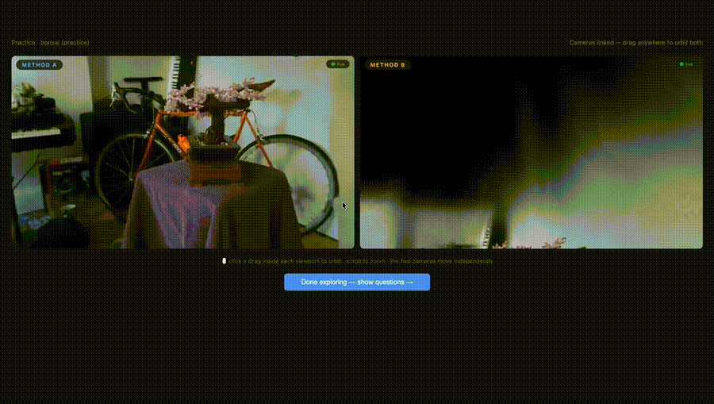

# Streaming — human-eval pipeline for 3D rendering

A web-based, interactive human-eval pipeline for comparing 3D rendering
methods under live novel-view synthesis. Two self-contained case studies
ship with the repo, each with its own backend launcher and viewer page.



The harness is renderer-agnostic: any process that consumes camera-pose
deltas on a WebSocket and pushes H.264 over RTSP can plug in.


---

## 📄 Full project report

For motivation, system design, case-study results, participant feedback,
and limitations, see the full report in [`report/`](report/):

- 📑 **[`report/report.md`](report/report.md)** — narrative writeup (markdown)
- 📄 **[`report/main.pdf`](report/main.pdf)** — formal LaTeX version with all appendices

The rest of this README covers what the framework collects, the two case
studies at a glance, and how to run the pipeline yourself.

---

## Motivation

The dominant evaluation paradigm for novel view synthesis — PSNR / SSIM /
LPIPS computed on a held-out test camera — measures something different
from what an end user actually experiences. Real users **drag the camera
around interactively**, look where they want to look, and form an
opinion that is conditioned on *which views* they chose to inspect. The
pipeline lets us collect that opinion at scale.

The intended end-state: a graphics researcher who has just developed a
new 3D reconstruction / NVS model can plug their renderer into this
framework, recruit participants, and run a perception study against a
baseline or in isolation. The current repository is a prototype of that
vision.

Note that the goal is **not** to replace numerical metrics like PSNR and
MS-SSIM — it is to provide a qualitative, interactive signal that those
metrics cannot. We focus on indoor and outdoor **scenes** rather than
synthetic objects.

## What the framework collects

Per stimulus (or per pair, in comparison mode):

- **Foreground quality** — 0–100 slider (the object of interest).
- **Background quality** — 0–100 slider.
- **Rendering smoothness** — 0–100 slider.
- **Comparison-mode extras**
  - Overall preference (7-point scale, –3 strongly-A → +3 strongly-B).
  - Aspect attribution (multi-select: foreground / background / smoothness).
- **Free-text comments** on the scene / session.
- **Mouse-trajectory log** over the viewing window.

A post-session participant satisfaction survey (Google Form) collects
direct self-report on perceived smoothness, UI clarity, and fatigue.

## Case studies

Two case studies exercise the framework. Detailed results, figures, and
discussion live in the [full report](report/report.md); the descriptions
below are the operational summaries.

### Case study 1 — i-NGP vs Nexels under matched budget

Given a feed-forward neural representation
([Instant-NGP](https://nvlabs.github.io/instant-ngp/)) and a
hybrid neurally-textured-surfels representation
([Nexels](https://arxiv.org/abs/2512.13796))
trained to comparable storage budgets (~14 MB per scene), *which one do
humans prefer when they get to drive the camera*, and which axis
(foreground, background, smoothness) drives that preference?

Launcher: `./start_methods.sh`. Viewer:
`viewer/cross_method_side_by_side.html`.

Six mip-NeRF-360 scenes (`bicycle / counter / garden / kitchen / room /
stump`) plus `bonsai` as a fixed practice pair. Pair order shuffles per
participant; A/B side coin-flips per pair; method identity is hidden on
the badges except in test mode. Both renderers stream concurrently into
independently-draggable viewports.

### Case study 2 — perceptual convergence of 3DGS

3DGS trains for 30k iterations by default, but quality plateaus much
earlier on many scenes. *At what iteration does additional training
stop yielding perceptually meaningful gains?* And how well do
reference-image metrics (PSNR / SSIM / LPIPS) predict that plateau?

Launcher: `./start_convergence.sh`. Viewer:
`viewer/convergence_interactive.html`.

Two scenes (`truck / train` from Tanks & Temples), each rendered from
four 3DGS checkpoints (1k / 3k / 7k / 30k iters) — eight stimuli total.
Scene order randomised per participant; iters ascending within each
scene so the rater feels the convergence trajectory. A per-scene
reference video plays once before that scene's block.

---

## Try it / reproduce

The system runs on a single GPU instance (we used AWS L4, 24 GB VRAM,
`g6.xlarge`). Open ports `8080 / 8765 / 8889 / 8189` (RTSP `8554` is
internal-only).

```bash
# Install dependencies
./install.sh

# Run the comparison case study (i-NGP vs Nexels)
./start_methods.sh                  # default SIZE=small
SIZE=medium ./start_methods.sh      # larger model tier

# Run the convergence case study (3DGS at 4 iter counts)
./start_convergence.sh
DEFAULT=train:1k ./start_convergence.sh   # start at a different ckpt
```

Open the viewer in a browser:

- Comparison: `http://<GPU_IP>:8080/viewer/cross_method_side_by_side.html`
- Convergence: `http://<GPU_IP>:8080/viewer/convergence_interactive.html`

Replace `<GPU_IP>` with whatever `curl ifconfig.me` reports on the GPU
host. The launchers self-heal the public-IP advertisement in
`mediamtx.yml`, so first-time launch works without manual config edits.

To add a new renderer, see the renderer contract described in
[`report/report.md`](report/report.md) §6 — at a high level, expose a
WebSocket port for pose deltas, push H.264 over RTSP, and register one
line in `ws_mux.py` and one in `mediamtx.yml`.

---

## Repo layout

```
interactive-3d-human-eval/
  README.md                        this file
  install.sh

  start_methods.sh                 launcher: comparison case study
  start_convergence.sh             launcher: convergence case study

  interactive_renderer.py          i-NGP renderer (pyngp, headless)
  nexels_renderer.py               Nexels renderer (diff-nexel-rasterization)
  gsplat_renderer.py               3DGS renderer (gsplat.rendering.rasterization)
  ws_mux.py                        single-port WS multiplexer
  serve.py                         static + POST /submit
  mediamtx.yml                     mediamtx config

  viewer/
    cross_method_side_by_side.html comparison case study
    convergence_interactive.html   convergence case study

  assets/                          architecture diagram, result figures, demo GIF
  report/
    report.md                      narrative writeup (this is the project page)
    main.pdf                       full LaTeX report with appendices
```
