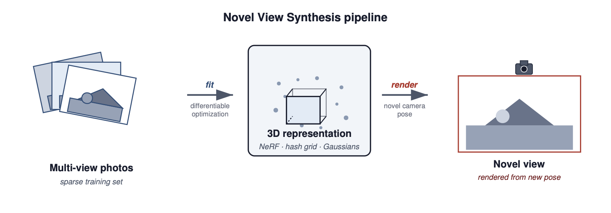
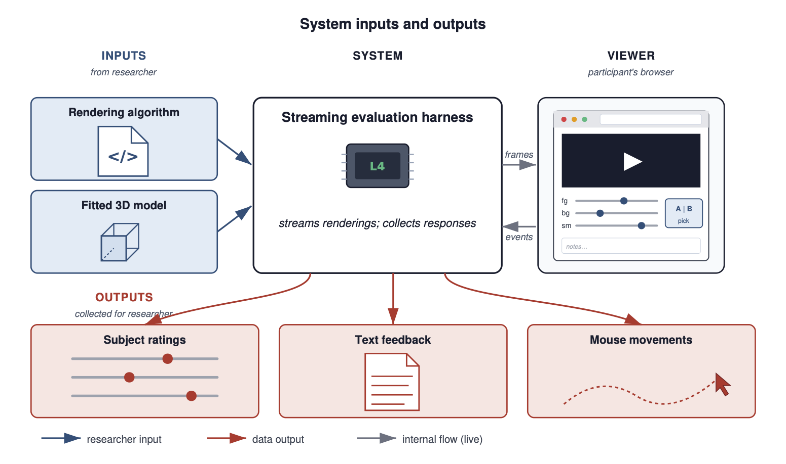
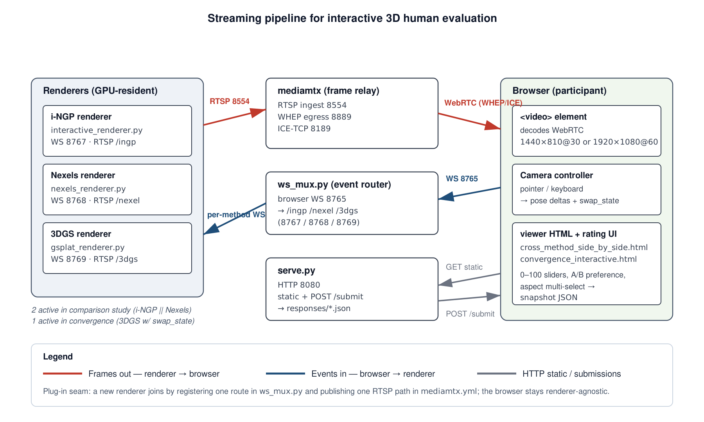
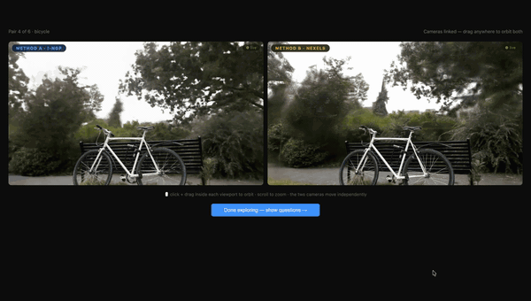
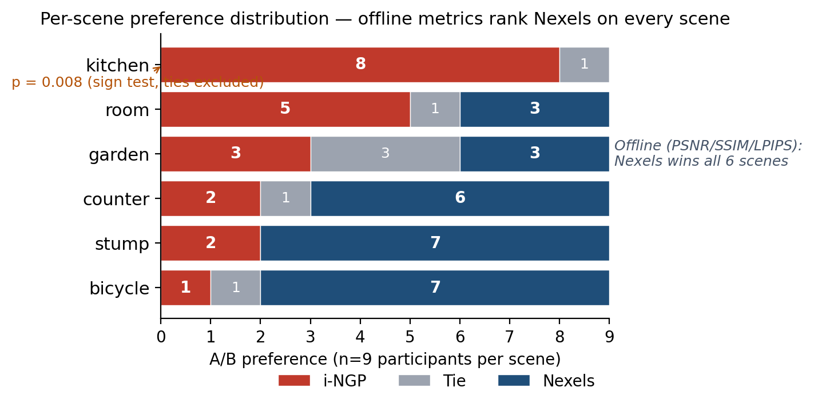
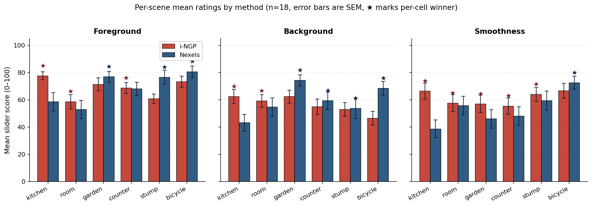
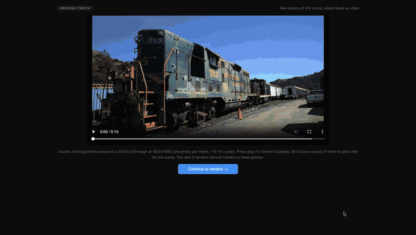
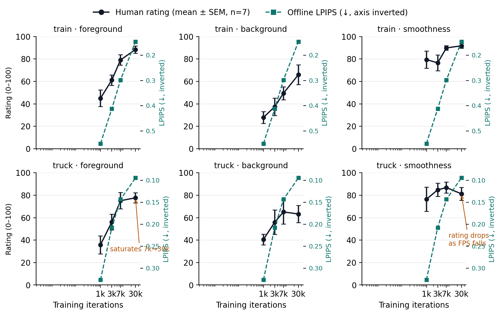
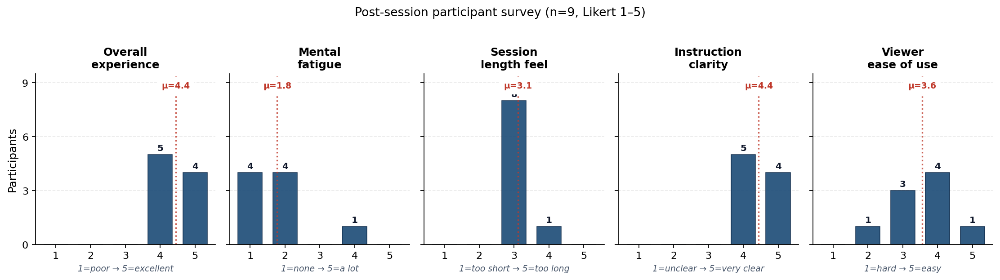

# Interactive Streaming Harness for Human Evaluation of Real-Time 3D Renderers

*CS348K Spring 2026 Final Report*

**Connor Ding** (czsding@stanford.edu) · **Ishita Gupta** (ishitagupta@stanford.edu)
Stanford University

📄 [Full LaTeX report (PDF)](CS348K_Final_Report.pdf) — formal version with all appendices,
statistical tests, and limitations.

---

## 1. Background — Novel View Synthesis

Novel View Synthesis (NVS) reconstructs a 3D representation of a scene from a
sparse collection of photographs, so that views from new camera poses can be
rendered after training. Modern NVS methods optimize either differentiable
neural fields (NeRF, Instant-NGP) or Gaussian primitives (3D Gaussian
Splatting) and have advanced rapidly in both quality and inference speed.

## 2. How NVS quality is reported today

Research papers measure quality in two ways: **image-based numerical metrics**
(PSNR, SSIM, LPIPS, all computed on held-out test cameras), and
**qualitative side-by-side renderings** at a fixed set of viewpoints.

## 3. The gap — interactive perception

Both reporting modes evaluate *static frames at fixed camera poses*. But
real users **drag the camera around interactively**, look where they want,
and form an opinion based on the views *they* chose to inspect. Free
navigation introduces failure modes — popping, floater drift, smoothness
artifacts at oblique angles — that no static-image metric can detect.

## 4. So why don't NVS papers report perceptual metrics?

Two reasons:

1. **No off-the-shelf metric for interactive 3D.** LPIPS works on static
   frames and is itself a proxy; there's no equivalent for free-roam 3D.
2. **Running a perceptual study is a real infrastructure project.** You
   need real-time rendering, a streaming pipeline, per-method renderer
   wrapping, a participant UI, and data collection.

*This is the infrastructure gap our system closes.*

## 5. Constraints that shape the system

Two constraints jointly motivate the streaming architecture:

1. **Participants' laptops have no GPU.** We can't ship the renderer to
   the participant. The renderer must run remotely on a GPU-equipped host
   (we used an AWS L4 instance) and stream rendered frames to the
   participant's browser over the network.
2. **Every NVS method has its own rendering stack** — CUDA hash grids for
   i-NGP, a custom rasterizer for Nexels, the `gsplat` differentiable
   rasterizer for 3DGS. We don't want to integrate with each method's
   native output format. Streaming a common video format (H.264) abstracts
   that diversity away: every renderer emits the same output regardless of
   internal representation.

## 6. Goal — collect human ratings of interactive 3D viewing

The system measures a dimension of rendering quality that image-based
metrics on held-out static frames cannot capture: the participant's
**interactive perceptual experience under continuous, free-roaming
viewing**. The collected data is intended as citable evidence a researcher
can use to support claims about how their method actually behaves in
interactive use, complementing rather than competing with offline numbers.

### Inputs and outputs

Researchers provide a rendering algorithm and a fitted 3D model. The
system streams those renderings to participants and collects three
categories of response data: subject ratings (sliders + A/B preferences
+ aspect citations), free-text feedback, and mouse-trajectory logs.

### Architecture

Each renderer is wrapped in a thin process that consumes camera-pose
deltas on a per-method WebSocket and pushes H.264 over RTSP to a
`mediamtx` instance, which relays to the browser over WebRTC. A single
browser-facing WebSocket multiplexer (`ws_mux.py`) routes pose-delta
messages, and a static HTTP server (`serve.py`) hosts the viewer pages
and accepts rating submissions. All server-side processes colocate on a
single AWS L4 GPU instance.

The **plug-and-play seam** is a renderer contract: pose-deltas in on a
WebSocket, H.264 over RTSP out, optional `swap_state` to flip the active
model in place. Adding a new method is a few-line configuration change in
`ws_mux.py` and `mediamtx.yml`; the browser stays renderer-agnostic.

## 7. Evaluating the evaluator — three success criteria

⚙️ **System side:** did the streaming pipeline work for diverse NVS
methods? Concretely: all three target renderers (i-NGP, Nexels, 3DGS)
integrated through the same contract without touching the viewer or
study logic; the comparison renderers sustained 30 fps at 1440×810
throughout; the convergence renderer sustained 60 fps at 1920×1080
across all four checkpoints; no session was abandoned due to a
streaming-side failure.

🔬 **Researcher side:** does the data answer the researcher's question?
Concretely: every session leaves a snapshot JSON; the data has
informative structure (within-participant slider spread, non-degenerate
A/B distributions, distributed aspect citations); the data shape is
general enough for whatever analysis the researcher prefers.

👤 **Participant side:** was the session smooth, clear, easy to use?
Concretely: interactive latency was imperceptible; no participant
abandoned mid-session; the rating UI needed no experimenter
intervention.

## 8. Case study A — i-NGP vs Nexels at matched storage

Given a ≈14 MB storage budget per scene, we compared two NVS methods:

- **i-NGP** — a pure neural-network approach with multi-resolution hash
  grids ([Müller et al., 2022](https://nvlabs.github.io/instant-ngp/))
- **Nexels** — a hybrid representation using neural textures over surfels
  with sparse geometries ([Rong et al., 2025](https://arxiv.org/abs/2512.13796))

Six mip-NeRF-360 scenes (`bicycle / counter / garden / kitchen / room /
stump`), `bonsai` as a practice pair. Two viewports rendered concurrently
and independently orbited by the participant.

**Hypothesis:** Nexels has better static-image metrics → Nexels will
provide a better interactive perceptual experience.

### Result 1 — Nexels wins every numerical metric

| Scene | PSNR↑ (i-NGP / Nex) | LPIPS↓ (i-NGP / Nex) | FPS (i-NGP / Nex) |
|---|---:|---:|---:|
| bicycle | 21.9 / **22.2** | 0.59 / **0.42** | **62** / 30 |
| counter | 25.3 / **26.4** | 0.27 / **0.22** | **62** / 30 |
| garden | 23.1 / **23.5** | 0.46 / **0.32** | **75** / 34 |
| kitchen | 27.1 / **27.7** | 0.21 / **0.17** | **96** / 32 |
| room | 28.5 / **29.2** | 0.23 / **0.21** | **70** / 30 |
| stump | 21.7 / **23.9** | 0.57 / **0.40** | 27 / **33** |

Nexels wins PSNR / SSIM / LPIPS on all six scenes. i-NGP wins FPS on
five of six scenes (only `stump` is reversed).

### Result 2 — but human preference is near-even, with one dramatic reversal

The aggregate A/B preference is **44 / 49 / 12** (i-NGP / Nexels / tie) —
close to chance. But the per-scene picture is heterogeneous: `bicycle`
swings 13–3–2 to Nexels (*p* = 0.007), `kitchen` swings **14 / 2 / 2 to
i-NGP** (*p* = 0.004). Every offline metric on `kitchen` favors Nexels,
and yet 14 of 18 participants chose i-NGP.

### Result 3 — what's driving the disagreement?

Looking inside each scene by aspect: **Nexels wins detail** (foreground
and background, in most scenes) but **i-NGP wins motion** (smoothness on
five of six scenes). The kitchen reversal is the extreme case — the
smoothness gap on kitchen (28 points) outweighs Nexels' edge on the
other two aspects.

Aspect-citation counts split by which method the citer chose make this
even clearer: i-NGP-choosing citers cite all three aspects evenly
(24 / 21 / 22 across the three aspects), but **Nexels-choosing citers
mention smoothness only 12 times against 33 / 38 for foreground /
background**. The headline:

> *Nexels voters were voting on what they saw; i-NGP voters were voting
> on what they saw and how it moved.*

### Result 4 — the data is informative, but not yet conclusive

**What our system supports** (and we surface in [`CS348K_Final_Report.pdf`](CS348K_Final_Report.pdf)
Appendix B):
- Foreground / background / smoothness rating analysis
- Aspect-citation analysis (Mann–Whitney *U* on cited-vs-not effects)
- Spearman correlations of preference against each offline-metric gap
- Free-text response collection

**What researchers do themselves** (which our system explicitly does
not support — non-goals):
- Advanced statistical methods (inter-rater agreement, multilevel
  models, etc.)
- Fine-tuning their algorithms for better quality or faster rendering
- Participant recruitment and ethics workflow

## 9. Case study B — perceptual convergence of 3DGS

A single method (3D Gaussian Splatting) trained for varying numbers of
iterations (1k / 3k / 7k / 30k) on two Tanks-and-Temples scenes (`train`,
`truck`). Eight stimuli total. All eight checkpoints GPU-resident so
checkpoint swaps are constant-time. Per-scene reference photo slideshow
plays once before each scene's rating block.

`train` improves monotonically on all three aspects from 1k → 30k. But
on `truck`, foreground saturates between 7k and 30k, and **smoothness
drops 23 points** (82.9 → 60.1) as the model grows from 2.5M splats at
7k to 3.8M at 30k. Offline LPIPS keeps improving (0.143 → 0.095), but
the participant feels the frame-time tax — and on this scene, the
4×-longer training buys a 34% LPIPS improvement that *doesn't perceptibly
help*, while costing enough rendering speed that smoothness ratings drop
measurably.

## 10. Participant feedback

After each session participants completed a five-question Likert survey
plus optional free-text comments.

Overall experience and instruction clarity both sit at mean 4.4 / 5,
with 8 of 9 respondents rating session length "just right." The weakest
dimension is viewer ease of use (mean 3.6 / 5) — one participant rated
it 2, the same participant who also reported the highest fatigue.

**Free-response feedback:** participants reported overall positive
experience — *"really impressed by the different spaces it could
capture"* · *"VERY CLEAR INSTRUCTIONS!"* · *"really liked this one —
clear how much better things were improving over time"* — with common
suggestions including a reset-view button, less-sensitive zoom, and
consistent camera-drag direction.

## 11. Discussion

The case studies exercise the harness, surface findings that offline
metrics alone could not, and produce data with the structure required to
support downstream analyses a researcher might want to run. The
substantive claims — that PSNR is uninformative for interactive
preference, that FPS is the strongest single predictor, that 3DGS
overshoots `truck` at 30k — are properly the researcher's to make from
the data we deliver; the system's contribution is making them
*measurable*. See [`CS348K_Final_Report.pdf`](CS348K_Final_Report.pdf) §3.4 and Appendix B for the
formal analyses.

## 12. Limitations

The most important limitation is sample size (n=18 cross-method, n=12
convergence). Additional threats to validity — display variance, network
variance, selection bias, order effects, blinding integrity — are
detailed in [`CS348K_Final_Report.pdf`](CS348K_Final_Report.pdf) §3.6.

## 13. Future work

- Standardized inter-rater agreement (Kendall's *W*, ICC(2,*k*)) at the
  current sample size
- Mouse-trajectory replay analysis: would a participant's rating have
  been the same had they only seen the held-out test camera?
- Additional rendering methods plugged into the same harness via the
  contract documented in [`CS348K_Final_Report.pdf`](CS348K_Final_Report.pdf) §2.2
- Generalization to non-NVS rendering domains (e.g., real-time
  game-engine quality settings)

## Acknowledgments

We thank our friends, labmates, and members of the Stanford CS community
who participated in the studies and provided feedback. This work was
completed for CS348K (Real-Time Rendering Systems and Methods), Stanford
University, Spring 2026.
